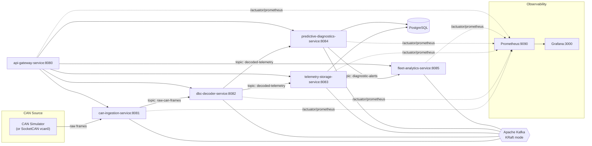

# Connected Vehicle Telemetry & Predictive Diagnostics Platform

A distributed, cloud-native, **event-driven** platform that ingests vehicle CAN
bus data, decodes it with a DBC file, stores time-series telemetry, runs
predictive diagnostics, and aggregates fleet-wide analytics — fully
containerised so the **entire stack runs with a single command**:

```bash
git clone <repo> && cd proj1
cp .env.example .env
docker compose up --build
```

No local Java, Maven, Kafka or Postgres required — only **Docker**. CAN ingestion
defaults to a built-in **simulator**, so it runs on any laptop with no CAN hardware.

---

## Architecture



**Data flow:** CAN frames → Kafka (`raw-can-frames`) → DBC decode → Kafka
(`decoded-telemetry`) → *fan-out* to storage **and** diagnostics → alerts
(`diagnostic-alerts`) → fleet analytics. Every hop is a Kafka topic, so services
are decoupled and independently scalable.

### Microservices

| Service | Port | Consumes | Produces | Responsibility |
|---|---|---|---|---|
| `can-ingestion-service` | 8081 | — | `raw-can-frames` | Read SocketCAN or simulate CAN frames |
| `dbc-decoder-service` | 8082 | `raw-can-frames` | `decoded-telemetry` | Decode raw frames with a DBC file |
| `telemetry-storage-service` | 8083 | `decoded-telemetry` | — (Postgres) | Persist + query time-series telemetry |
| `predictive-diagnostics-service` | 8084 | `decoded-telemetry` | `diagnostic-alerts` | Anomaly detection, health scores, alerts |
| `fleet-analytics-service` | 8085 | `diagnostic-alerts` | — | Fleet-wide aggregates & top fault codes |
| `api-gateway-service` | 8080 | — | — | Single entry point (Spring Cloud Gateway) |

Infrastructure: **Kafka** (KRaft, no Zookeeper), **PostgreSQL 16**,
**Prometheus**, **Grafana**.

---

## Tech stack

- **Java 17**, **Spring Boot 3.3.5**, Maven **multi-module** project
- **Apache Kafka** (KRaft mode) via `spring-kafka`, JSON payloads
- **PostgreSQL** with an indexed, time-series-friendly schema (auto-initialised)
- **Spring Cloud Gateway** for the API gateway
- **Micrometer + Prometheus + Grafana** (2 pre-provisioned dashboards)
- **springdoc-openapi** (Swagger UI) on every REST service
- **Docker multi-stage builds** (Maven build stage → slim JRE runtime)

---

## Prerequisites

- **Docker** 20.10+ and **Docker Compose v2** (`docker compose`, not `docker-compose`).
- ~4 GB free RAM for the full stack.
- That's it. Everything else runs in containers.

---

## Quick start

```bash
cp .env.example .env          # all tunables live here
docker compose up --build     # build images + start everything
# ... or with the Makefile:
make up                       # build + start detached
make logs                     # tail logs
make ps                       # container status
make down                     # stop
make clean                    # stop + delete volumes (wipes DB)
```

First build compiles all modules inside a Maven container (a few minutes; Maven
dependencies are cached in a named volume for subsequent builds).

Once healthy, data flows automatically (simulator is on by default). Verify:

```bash
curl localhost:8080/api/ingestion/status
curl localhost:8080/api/diagnostics/health
curl localhost:8080/api/fleet/summary
```

---

## Endpoints & URLs

Everything is reachable through the **gateway on `:8080`**, or directly per service.

| What | URL |
|---|---|
| API Gateway (index) | http://localhost:8080/ |
| Ingestion status | http://localhost:8080/api/ingestion/status |
| Decoder — DBC messages | http://localhost:8080/api/decoder/messages |
| Telemetry query | http://localhost:8080/api/telemetry?vehicleId=VIN-0001&signal=CoolantTemp |
| Diagnostics — health | http://localhost:8080/api/diagnostics/health |
| Diagnostics — alerts | http://localhost:8080/api/diagnostics/alerts?activeOnly=true |
| Fleet summary | http://localhost:8080/api/fleet/summary |
| **Grafana** | http://localhost:3000 (login `admin` / `admin`) |
| **Prometheus** | http://localhost:9090 |

### Swagger / OpenAPI

Each REST service serves interactive API docs:

- Ingestion: http://localhost:8081/swagger-ui.html
- Decoder: http://localhost:8082/swagger-ui.html
- Storage: http://localhost:8083/swagger-ui.html
- Diagnostics: http://localhost:8084/swagger-ui.html
- Analytics: http://localhost:8085/swagger-ui.html

OpenAPI JSON is at `/v3/api-docs` on each. See [`requests.http`](requests.http)
for ready-to-run requests (VS Code REST Client / IntelliJ HTTP client).

### Grafana dashboards

Auto-provisioned under the **Connected Vehicle** folder:

1. **Vehicle Health Overview** — per-vehicle health score, coolant temp, RPM,
   battery voltage, active alert rate.
2. **Fleet & System Metrics** — throughput (frames/telemetry/alerts per second),
   Kafka consumer lag, HTTP rates, JVM heap/CPU, target up/down.

---

## Switching CAN simulator ↔ real hardware

Ingestion mode is controlled by `CAN_MODE` in `.env`:

```dotenv
CAN_MODE=simulator     # default — synthesises realistic frames, runs anywhere
CAN_MODE=hardware      # read a real/virtual SocketCAN interface
CAN_INTERFACE=vcan0
```

**Simulator** (default) generates realistic RPM, speed, coolant temperature,
battery voltage, throttle and occasional DTC fault codes for
`SIM_VEHICLE_COUNT` vehicles at `SIM_RATE_HZ`. It deliberately runs a couple of
fault scenarios (vehicle 0 gradually overheats, vehicle 1's battery degrades) so
the diagnostics and alerting pipeline has something to detect.

**Hardware mode** reads a Linux SocketCAN interface via `candump` (from
`can-utils`). On a Linux host, first create a virtual CAN interface:

```bash
make hardware-can        # runs: modprobe vcan; ip link add vcan0 type vcan; ip link set up vcan0
```

Then set `CAN_MODE=hardware`, run the ingestion container with host networking
and the `NET_ADMIN`/`NET_RAW` capabilities so it can see the interface, and feed
it (e.g. `cansend vcan0 100#1027840000000000`). The bit layout expected by the
decoder is defined in [`sample.dbc`](dbc-decoder-service/src/main/resources/sample.dbc).
> Note: SocketCAN is Linux-only; on macOS/Windows use simulator mode.

---

## The DBC / CAN encoding

The bundled DBC ([`sample.dbc`](dbc-decoder-service/src/main/resources/sample.dbc))
defines three messages (Intel / little-endian byte order):

| CAN ID | Message | Signals |
|---|---|---|
| `0x100` | EngineData | EngineSpeed (rpm, ×0.25), CoolantTemp (°C, −40 offset), ThrottlePosition (%, ×0.4) |
| `0x200` | BatteryData | BatteryVoltage (V, ×0.001), VehicleSpeed (km/h, ×0.01) |
| `0x300` | FaultData | FaultCode (mapped to Pxxxx DTC strings) |

The simulator encodes signals into raw frames using the exact same bit layout
the decoder uses to extract them, so decoded values round-trip precisely. Point
`DBC_FILE` at your own `.dbc` to decode a different bus.

---

## Configuration (`.env`)

All ports, credentials, Kafka/topic names, CAN mode and diagnostics thresholds
are in `.env` (see [`.env.example`](.env.example)). Notable diagnostics knobs:

```dotenv
COOLANT_TEMP_WARN=105     # °C  -> WARNING overheat
COOLANT_TEMP_CRIT=115     # °C  -> CRITICAL overheat
BATTERY_VOLTAGE_MIN=11.8  # V   -> battery-low alert
RPM_MAX=6500              # rpm -> high-RPM alert
ZSCORE_THRESHOLD=3.0      # rolling z-score for RPM anomaly detection
```

---

## Database

PostgreSQL schema is created automatically on first start from
[`infra/postgres/init/01_schema.sql`](infra/postgres/init/01_schema.sql):

- `telemetry` — narrow append-only time-series table; composite btree index
  `(vehicle_id, signal, ts)` plus a BRIN index on `ts`.
- `diagnostic_alerts` — alerts with a partial index on active (unresolved) rows.

Connect for a look:

```bash
docker compose exec postgres psql -U fleet -d telemetry -c "select count(*) from telemetry;"
```

---

## Kubernetes (advanced)

Manifests live in [`k8s/`](k8s/) (Namespace, ConfigMap, Secret, Deployments,
Services). Build & load the images into your cluster, then:

```bash
kubectl apply -f k8s/
kubectl -n connected-vehicle port-forward svc/api-gateway-service 8080:8080
```

See [`k8s/README.md`](k8s/README.md) for image-building/loading (kind/minikube)
and access instructions.

---

## Project layout

```
proj1/
├── pom.xml                          parent (multi-module)
├── docker-compose.yml               full stack, one command
├── .env.example                     all configuration
├── Makefile                         make up / down / logs / clean / test
├── requests.http                    REST endpoint tests
├── common-lib/                      shared Kafka DTOs (CanFrame, DecodedTelemetry, DiagnosticAlert)
├── can-ingestion-service/           SocketCAN + simulator -> raw-can-frames
├── dbc-decoder-service/             DBC decode -> decoded-telemetry (+ sample.dbc)
├── telemetry-storage-service/       persist + query (Postgres)
├── predictive-diagnostics-service/  anomaly detection -> diagnostic-alerts
├── fleet-analytics-service/         fleet aggregates + Prometheus
├── api-gateway-service/             Spring Cloud Gateway
├── infra/
│   ├── prometheus/prometheus.yml
│   ├── grafana/provisioning/        datasource + 2 dashboards
│   └── postgres/init/01_schema.sql
└── k8s/                             Kubernetes manifests
```

---

## Troubleshooting

| Symptom | Fix |
|---|---|
| `docker compose up` fails on `.env` | Run `cp .env.example .env` first (or `make env`). |
| Services restart / can't reach Kafka | They wait for Kafka's healthcheck; give it ~30–60s on first boot. Check `docker compose logs kafka`. |
| No telemetry / empty queries | Confirm ingestion is running: `curl localhost:8081/api/ingestion/status` (framesSeen should climb). Consumers use `earliest`, so data appears shortly after startup. |
| Port already in use | Change the `*_PORT` values in `.env`. |
| Grafana panels empty | Prometheus needs a scrape or two (~10–20s). Check targets at http://localhost:9090/targets. |
| Rebuild from scratch | `make clean && make up` (deletes volumes incl. DB and Kafka data). |
| Slow first build | Maven downloads deps once into the `cvp-m2` volume; later builds are fast. |
| Want more/less load | Tune `SIM_VEHICLE_COUNT` / `SIM_RATE_HZ` in `.env`. |

---

## Handy commands

```bash
make help          # list all make targets
make config        # validate & render the compose config
make test          # run unit tests in a Maven container
docker compose ps  # what's running
docker compose logs -f predictive-diagnostics-service
```
